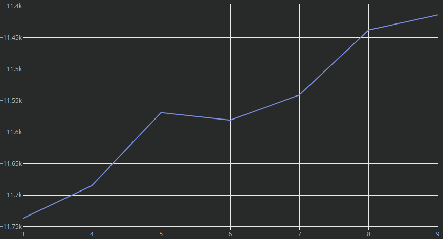

# Results

## raw

### 3 Clusters

elbow score: -11737

- Cluster 0: jour mise fr com accès www
- Cluster 1: infog gestion infogérance service suzanne capucine
- Cluster 2: supervision anomalies traitement semaine jérôme théodore

### 4 Clusters

elbow score: -11685

- Cluster 0: installation accès problème compte poste mail
- Cluster 1: www fr http https com page
- Cluster 2: jour mise infog mises gestion infogérance
- Cluster 3: supervision anomalies traitement semaine jérôme théodore

### 5 Clusters

elbow score: -11569

- Cluster 0: installation accès problème compte poste mail
- Cluster 1: infog gestion infogérance service suzanne capucine
- Cluster 2: supervision anomalies traitement semaine jérôme théodore
- Cluster 3: jour mise mises emmanuelle sécurité mettre
- Cluster 4: www fr http https com page

### 6 Clusters

elbow score: -11581

- Cluster 0: installation supervision compte poste argedis création
- Cluster 1: infog gestion infogérance service suzanne capucine
- Cluster 2: jour mise mises emmanuelle sécurité mettre
- Cluster 3: accès problème impossible connexion plus site
- Cluster 4: http www https fr page com
- Cluster 5: josette suivie blocages livraisons évolutions dates

### 7 Clusters

elbow score: -11541

- Cluster 0: http www https page com fr
- Cluster 1: mises jour sécurité gérard cerbere présence
- Cluster 2: supervision compte problème mail argedis poste
- Cluster 3: jour mise emmanuelle droits brigitte mettre
- Cluster 4: installation imprimante certificat total poste sophos
- Cluster 5: accès alterway fr mettre jour problème
- Cluster 6: infog gestion infogérance service suzanne capucine

### 8 Clusters

elbow score: -11438

- Cluster 0: josette suivie blocages livraisons évolutions dates
- Cluster 1: installation problème mail place argedis plus
- Cluster 2: jour mise mises emmanuelle sécurité mettre
- Cluster 3: compte création caroline stéphanie christelle créer
- Cluster 4: infog gestion infogérance service suzanne capucine
- Cluster 5: accès problème alterway partage site plus
- Cluster 6: supervision anomalies traitement semaine jérôme théodore
- Cluster 7: http www https fr com page

### 9 Clusters

elbow score: -11414

- Cluster 0: installation problème mail plus imprimante argedis
- Cluster 1: place mise mettre backups supervision site
- Cluster 2: jour mise mises emmanuelle sécurité gérard
- Cluster 3: accès problème alterway site partage plus
- Cluster 4: supervision anomalies traitement semaine jérôme théodore
- Cluster 5: infog gestion infogérance service suzanne capucine
- Cluster 6: http www https fr com page
- Cluster 7: josette suivie blocages livraisons évolutions dates
- Cluster 8: compte droits christelle caroline gabrielle margot

## elbow curve

The elbow curves does not permit to identify an ideal number of clusters.

## Analysis of the 5 cluster case

| Cluster id | theme                                | size | mean te | std te |
|------------|--------------------------------------|------|---------|--------|
| 0          | installation-acces-mail              | 8869 | 127     | 226    |
| 1          | ingogérence-service                  | 150  | 48      | 130    |
| 2          | supervision-anomalies                | 140  | 109     | 162    |
| 3          | mise-à-jour-sécurité                 | 672  | 103     | 192    |
| 4          | web                                  | 2246 | 137     | 200    |

The cluster 1 contains periodical tast without any additional information but features a non neglictable standard derivation and 81% of zeros. We should consider excluding those tickets from the training set. The cluster 2 is equivalent with an other type of reminders.

We've created sub-clusters from the cluster 0 [here](RESULTS_0.md).
